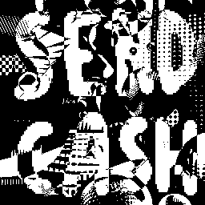

# GOTPi

GOTPi (Golang + OTP + images) is a lightweight Go CLI and library for experimenting with One-Time Pad (OTP) encryption using images as keys. It allows to generate random noise keys as PNGs (either Grayscale or RGB) and use them to bitwise-encrypt and decrypt image files. 

It supports key generation in two modes: standard black and white (Grayscale) or full color (RGB).

| bw | rgb |
| :---: | :---: |
|  |  |
| `gotpi key-gen` | `gotpi key-gen --rgb` |

## Two-Time Pad security
This is inspired by [this question](https://crypto.stackexchange.com/questions/59/taking-advantage-of-one-time-pad-key-reuse) on the secutiy of Two-Time Pad on StackOverflow. Indeed this tool is a great way to visualize why key reuse is fatal for OTP security.

If two different messages ($m_1​$ and $m_2​$) are encrypted with the same key ($k$), an attacker can XOR the two ciphertexts together. This removes the key and leaves the combined original messages in the hand of the adversary ($m_1 \oplus m_2​$). 

$$ c_1\oplus c_2 = (m_1 \oplus k) \oplus (m_2 \oplus k) = m_1 \oplus m_2 $$ 

Reusing the key multiple times gives the encryption depth, the more depth given, the more likely it is that information leaks. The attack is called [crib dragging](https://travisdazell.blogspot.com/2012/11/many-time-pad-attack-crib-drag.html).

If two images are encrypted using the same key, hence violating the rule of one-time, then an adversary can compute the xor of the two encryptions and gain an advantage, graphically:

| send-cash.enc.png | | vibrant.enc.png | | xoring leaks information|
| :---: | :---: | :---: | :---: | :---: |
|  | $\oplus$ |  | $=$ |  |

## Examples

| $m$ | | $k$ | | $m \oplus k = c$ |
| :---: | :---: | :---: | :---: | :---: |
|  | $\oplus$ |  | $=$ |  |

`gotpi enc -f vibrant.png -k rgb-key.png -o vibrant.enc.rgb.png --rgb`

| $c$ | | $k$ | | $c \oplus k = m$ |
| :---: | :---: | :---: | :---: | :---: |
|  | $\oplus$ |  | $=$ |  |

`gotpi dec -f vibrant.enc.rgb.png -k rgb-key.png -o vibrant.dec.rgb.png --rgb`


| $k$ | | $m$ | | $k \oplus m = c$ |
| :---: | :---: | :---: | :---: | :---: |
|  | $\oplus$ |  | $=$ |  |

`gotpi enc -f smiley.png -k bw-key.png -o smiley.enc.png`

| $c$ | | $k$ | | $c \oplus k = m$ |
| :---: | :---: | :---: | :---: | :---: |
|  | $\oplus$ |  | $=$ |  |

`gotpi dec -f smiley.enc.png -k bw-key.png -o smiley.dec.png`


## Installing

### As a CLI Utility

```
go install github.com/micheledinelli/gotpi/cmd/gotpi@latest
```

```
gotpi --help

[sub]Command required
usage: One-Time Pad image encryptor <Command> [-h|--help] [-v|--verbose]
                                    [-c|--rgb]

                                    encrypt and decrypt images using OTP images
                                    as keys

Commands:

  key-gen  Generate a new OTP key image
  enc      Encrypt an image using an OTP key image
  dec      Decrypt an image using an OTP key image
  xor      XOR two images together

Arguments:

  -h  --help     Print help information
  -v  --verbose  Print the encrypted image to terminal. Default: false
  -c  --rgb      use RGB mode instead of black and white. Default: false
```

### As a Package

```
go get -u github.com/micheledinelli/gotpi
```

```go
package main

import (
	"image"
	"image/png"
	"os"

	"github.com/micheledinelli/gotpi"
)

func main() {
	colored := true

	// Generate a key of 256x256 pixels
	k := gotpi.KeyGen(256, colored)

	// Load an image
	path := "image.png"
	f, err := os.Open(path)
	if err != nil {
		panic(err)
	}
	defer f.Close()
	img, _, err := image.Decode(f)
	if err != nil {
		panic(err)
	}

	// Encrypt the image
	out := gotpi.Encrypt(img, k, colored)

	// Save the output
	outF, err := os.Create("out.png")
	if err != nil {
		panic(err)
	}
	defer outF.Close()
	if err := png.Encode(outF, out); err != nil {
		panic(err)
	}
}
```

## Note

If you use a Grayscale key on an RGB image, the output will lose its color data because the key doesn't have enough "depth" to cover the R, G, and B channels.

| $m$ | | $k$ | | $c \oplus k = m$ |
| :---: | :---: | :---: | :---: | :---: |
|  | $\oplus$ |  | $=$ |  |

`gotpi enc -f vibrant.png -k bw-key.png -o vibrant.enc.png`

| $c$ | | $k$ | | $c \oplus k = m$ |
| :---: | :---: | :---: | :---: | :---: |
|  | $\oplus$ |  | $=$ |  |

`gotpi dec -f vibrant.enc.png -k bw-key.png -o vibrant.dec.png`

The opposite does work

| $k$ | | $m$ | | $k \oplus m = c$ |
| :---: | :---: | :---: | :---: | :---: |
|  | $\oplus$ |  | $=$ |  |

`gotpi enc -f abstract.png -k rgb-key.png -o abstract.enc.rgb.png`


| $c$ | | $k$ | | $c \oplus k = m$ |
| :---: | :---: | :---: | :---: | :---: |
|  | $\oplus$ |  | $=$ |  |

`gotpi dec -f abstract.enc.rgb.png -k rgb-key.png -o abstract.dec.rgb.png`